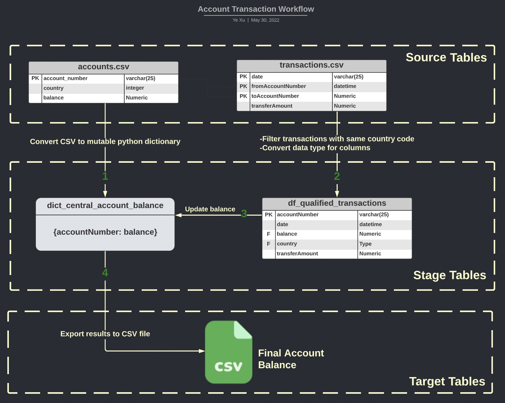
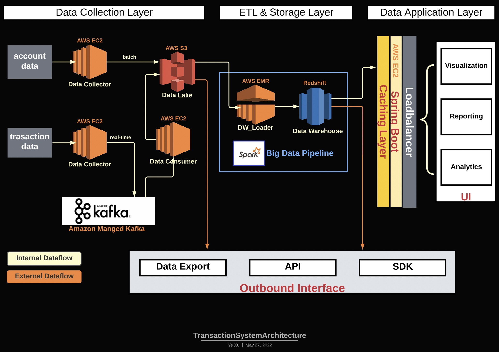

Spark System - Raw Data Parsing
==============================

##### Author: Ye Xu

Project Overview
----------------
This project is aim to use Spark big data technology to process transaction data in CSV format. The application will
calculate final balance for each account and output a CSV file with the information.

----------------
Dataset
--------

### ```accounts.csv```

| accountNumber        | country | balance  |
| ------------- |:-------------:| -----:|
| 0 | 44 | 70 |
| 1 | 89 |   40 |
| 2 | 27 |    41|

### ```transactions.csv```

| date        | fromAccountNumber | transferAmount  | toAccountNumber |
| ------------------- |:----:|:----:| -----:|
| 2021-11-29T05:47:26 | 2699 | 13 | 835|
| 2021-11-29T05:48:26 | 533 |  13 |7614|
| 2021-11-29T05:49:26 | 9710 | 12 |9420|

----------------

Challenge
----------
> #### 1. Account balance needs to be update sequentially 
> #### 2. Funds in and out of same accounts, that increase complexity of ETL process
>   - #### 2-1. Account balance is dynamically changing during the ETL run
>   - #### 2-2. All transactions with different timestamp need to be parsed in a single ETL run
>   - #### 2-3. Need to ensure consistency of account balance in a distributed computing manner
>   - #### 2-4. Transaction data requires Atomicity
----------------

Assumption
----------
> #### 1. The balance amount listed in `accounts.csv` is the initial account balance
> #### 2. All transactions begin at the earliest timestamp listed in `transactions.csv` file
> #### 3. At a given timestamp, there will be only one transaction between one source and one target accounts
> #### 4. Each row in `accounts.csv` is unique and represent one accountID


----------------
Workflow
--------
> ### 1. Read raw data from the 2 given CSV files
>### 2. Pre-Process Raw data
>    - #### 2-1. Use Spark Dataframe to convert column datatypes and register raw data as `sparkSQL` views
>    - #### 2-2. Use `SparkSQL` to `JOIN` the raw data and filter out across-country transactions, sort transactions by `date` column, ascending order
>    - #### 2-3. convert `accounts.csv` to python dictionary (mutable) for real-time balance updating
>### 3. Run balance computation based on the given business logic
>### 4. Generate CSV files with final accounts-balance results




----------------

Deployment Strategy
-------------------

### Local Deployment

#### We use docker to deploy the application, follow the below steps.

```buildoutcfg
# Step-0: Go to project directory 
cd << project directory >>

# Step-1: Build the docker image with Python and Spark dependencies
docker build -t img-rokt-system .

# Step-2: Create a container to run the spark application
docker run --rm -it -v $(pwd):/home/app/ --entrypoint bash img-rokt-system

# Step-3: Run the spark application inside docker contianer
>>> spark-submit main.py
```

### Cloud Platform Deployment

#### We can host the application on Amazon Web Service (AWS)

> - Snowflake / AWS Redshift (Data Warehouse to store structure data and run SQL for computing)
>- AWS S3: Data Lake to store RAW data files (CSV, JSON, Parquet etc...)
>- AWS ECR: Host docker image for cloud deployment
>- AWS EMR: Computing Cluster to run the Spark Big data jobs
>- AWS EC2: Cloud Server to host service to automatically submit Spark Jobs to EMR cluster
>- AWS Cloudformation: Orchestrate the whole deployment process

----------------


High-Level System Architecture
-------------------


-------------------


Testing Strategy
----------------

### We design the testing cases in 4 different categories:

1. Happy Path Test
2. Test when accounts have insufficient balance
3. Test when insufficient balance accounts receive sufficient funds for transfering
4. Test transfering across accounts from different country

> ### 1. Happy Path Tests (country_code = 0)
>#### 1-1. test_happy_path_1
>- Single-origin account transfer
>- Accepted further outbound transfers if balance is equal or higher than transfer amount
>- Transfer from single origin account to multiple target account
>
>
>#### 1-2. test_happy_path_2
>- Single-origin account transfer
>- Keep transfering funds until balance became insufficient
>
>#### 1-3. test_happy_path_3
>- Multi-origin account transfer
>- Accepted further outbound transfer if balance is equal or higher than transfer amount
>- Transfer from multiple origin accounts to multiple target account

> ### 2. Insufficient fund Test (country_code = 0)
>#### 2-1. test_insufficient_fund_1
>- Reject any further outbound transfers when balance is 0
>
>#### 2-2. test_insufficient_fund_2
>- Reject any further outbound transfers if balance is lower than transfer amount
>- Accepted further outbound transfer if balance is equal or higher than transfer amount


> ### 3. Insufficient fund first but sufficient later test (country_code = 0)
>#### 3-1. test_insufficient_sufficient_1
>- Reject first outbound transfers due to insufficient fund
>- Accept later outbound transfers due to new funds added to account, new balance became sufficient
>- Single-origin account
>
>#### 3-2. test_insufficient_sufficient_2
>- Reject first outbound transfers due to insufficient fund
>- Accept later outbound transfers due to new funds added to account, new balance became sufficient
>- Multi-origin accounts (Acct#1, Acct#2, Acct#5)
>- Accounts can transfer larger funds than original balance after accepting additional fund


> ### 4. Cross Country Test
>#### 4-1. test_cross_country
>- Reject any transfers if accounts are from different country


----------------
Operational Readiness
---------------------
> - Use `Grafana` and `Prometheus` to capture metrics
> - Capture `runtime metrics` to monitor system health
> - Capture `usage statistics` to monitor and estimate computing cost
> - Enhance logging we can also use Splunk to build dashboard
----------------
Optimization & Next Step
------------------------

1. Broadcast small datasets to worker nodes
2. Leverage Delta Lake table with Spark to support ACID operation
3. Further partition enforce on the input transaction data (e.g. Store raw data by country code and date path)
4. Spark Nodes/Cores tuning
5. Use Kafka streaming to update account balance in real-time
6. Store Account information in database so there is a centralized location to enforce data consistency
7. Add monitoring and alerting modules to increase system stability and reliability
